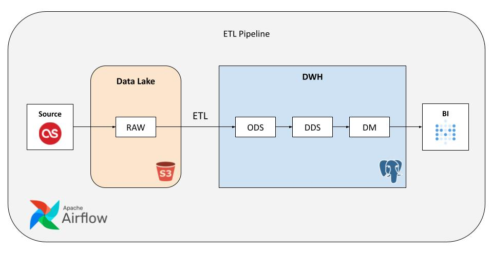
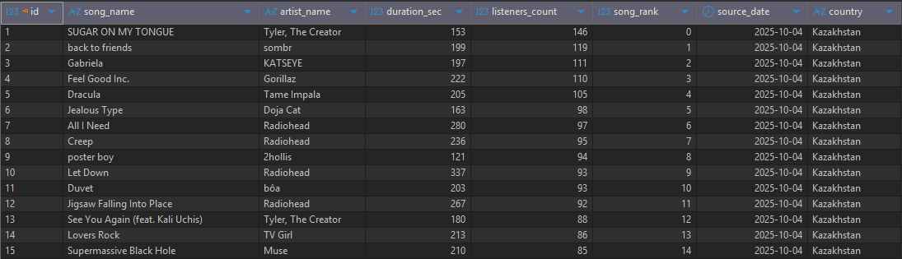
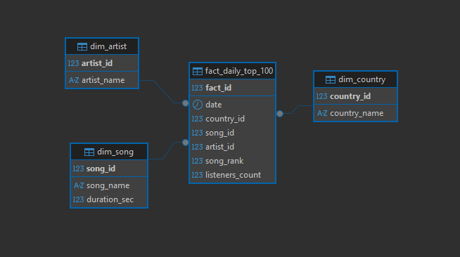
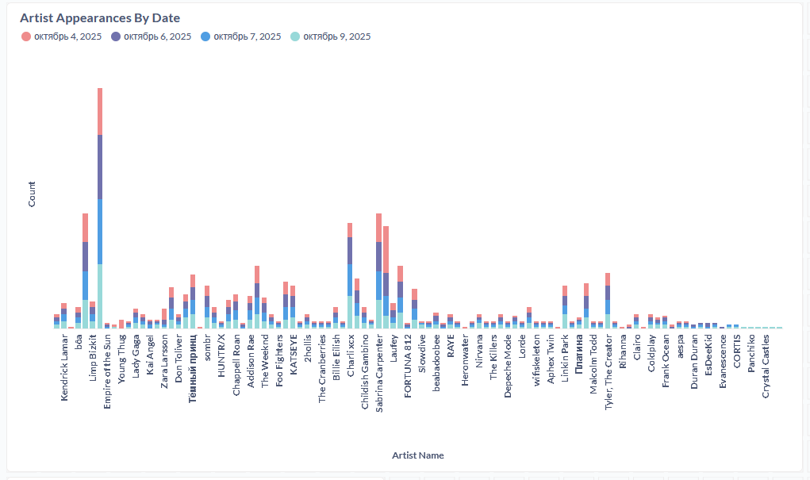

# ETL Pipeline Last.fm


## Технологический стек
- **Docker** - создание контейнеров для основных компонентов
- **Airflow** - оркестрация процессов
- **Python** - извлечение и обработка данных
- **Postgres** - хранилище данных
- **Minio S3** - озеро данных
- **Metabase** - визуализация и анализ данных

# Описание проекта
**Цель проекта** - построить ETL Pipeline для хранения и анализа ежедневных данных, получаемых из API источника.

**Задачи**:
1. Настроить извлечение сырых данных из API источника.
2. Построить ETL процесс для загрузки данных в хранилище.
3. Построить витрины данных для дальнейшей визуализации и анализа в BI системе.

## Извлечение данных из API
В качестве источника данных используется открытое [API Last.fm](https://www.last.fm/api).

Из многообразия доступных в API методов, выбор пал на **"geo.getTopTracks"**, который возвращает информацию о топе треков на текущий момент времени по запрашиваемой стране. В параметрах метода можно задать ограничение на количество треков и формат данных.

В данном проекте, в качестве примера, используются 3 страны: Russian Federation, United States, Kazakhstan. По запросу из API извлекается **топ 100** треков в формате **JSON**. Запрос отправляется при помощи библиотеки **requests** языка Python.

Полученные JSON файлы в необработанном виде помещаются в **озеро данных** (S3 хранилище) на холодное хранение. Запись данных осуществляется по ключу **"bucket/top_100/raw/{date}/{country}_{date}.json"**, где **{date}** - текущая дата, **{country}** - страна, для которой хранятся данные.

Процесс запускается ежедневно при помощи оркестратора **Airflow**, название DAG'a - ["raw_from_api_to_s3.py"](./dags/raw_from_api_to_s3.py). Подключение к S3 осуществляется через **S3Hook**, параметры подключения задаются через панель администратора в Airflow. Ключ для подключения к API хранится в виде переменной Airflow.

## Построение ETL процесса 
В качестве хранилища данных используется **Postgres**, состоящий из 3-х слоев: 
* **ODS** - таблица для хранения прошедших через **ETL** процесс данных;
* **DDS** - данные хранятся в виде модели **"звезда"**, разбитые на таблицы фактов и измерений;
* **DM** - слой для витрин данных.

Подключение к БД и создание таблиц происходит посредством **DBeaver**:
```
CREATE TABLE ods.daily_data(
    id serial PRIMARY KEY,
    song_name varchar(100),
    artist_name varchar(50),
    duration_sec int,
    listeners_count int,
    song_rank smallint,
    source_date DATE,
    country varchar(50),
    UNIQUE(song_rank, source_date, country)
);
```

Для построения **ETL** процесса применяется язык **Python**, так как получаемый объем данных небольшой и параллельная обработка не требуется. 
Извлечение, трансформация и загрузка данных выполняется ежедневно при помощи DAG'a **"transformed_from_s3_to_pg.py"**. В нем применяется **ExternalTaskSensor**, который ожидает завершения выполнения DAG'a с предыдущего шага, а затем начинает работу запланированных task'ов. 

Первым делом **извлекаются** ключи для файлов в S3 хранилище за текущую дату. Полученные ключи передаются в следующий task через **xcom**. 
Полученные по ключам JSON файлы проходят через **трансформацию**: из файлов извлекается необходимая информация, происходит очистка и преобразование типов данных. 
Трансформированные данные **загружаются** в Postgres базу данных в **ODS** слой при помощи SQL скрипта.

Пример данных, хранящихся в ODS слое:


Следующим шагом, данные из **ODS** слоя передаются в **DDS** слой в виде **"звезды"** для дальнейшей аналитики. За это отвечает DAG **"from_ods_to_dds_pg.py"**, в котором применяется **SQLExecuteQueryOperator**, передающий данные с помощью SQL скриптов.

Диаграмма **DDS** слоя выглядит следующим образом:


## Создание витрин данных для BI системы
В данном проекте, для наглядности, были созданы две витрины данных: **"avg_song_duration_by_country"** и **"artist_appearances_by_date"**. 
Для заполнения витрин данных используется DAG **"from_dds_to_dm.py"**, работающий аналогичным образом с DAG'ом из предыдущего шага.

В качестве BI системы используется **Metabase**, в которой строятся графики и дашборды по имеющимся витринам данных.

Пример визуализации по витрине **"artist_appearances_by_date"**:

